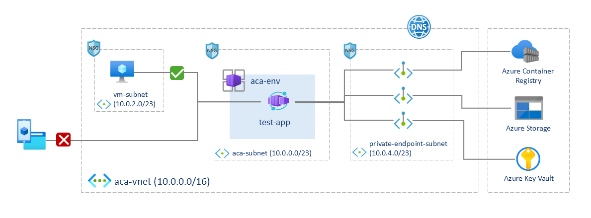

# Setting Up Azure Container Apps with Virtual Network Integration

This document guides you through setting up Azure Container Apps within a virtual network (VNet), including the following features. In this document, we deployed only one sample application. You can use it as a reference to deploy the ACME Fitness Sample applications in a VNet environment.

- Hosting Azure resources inside your own virtual network
- Pulling the Nginx image from Azure Container Registry (ACR)
- Mounting Azure Storage file inside the Azure Container Apps app
- Reading key-value pairs from Azure Key Vault as environment variables inside the Azure Container Apps app

## Architecture Diagram

The following architecture diagram provides a visual overview of the setup described in this document. It includes the key components and their interactions within the Azure environment. Users outside the Azure virtual network `aca-vnet` cannot access the container app running in the Azure Container Apps managed environment. The application can access Azure PaaS services such as Azure Container Registry, Storage, and Key Vault via Azure Private Link. You can also protect the private link endpoints of those Azure services using a network security group.



The subsequent sections of this document will guide you through the detailed steps of setting up each component as illustrated in the architecture diagram.

## Prerequisites

Before starting, ensure you have:

1. An Azure subscription. 
2. **Azure CLI** installed.

## Steps

### 1. Clone the repo

```bash
git clone https://github.com/Azure-Samples/acme-fitness-store.git
cd acme-fitness-store
```

### 2. Set up environment variables

1. Create environment variables file `setup-vnet-env-variables.sh` based on template.

```bash
cp azure-container-apps/scripts/setup-vnet-env-variables-template.sh setup-vnet-env-variables.sh -i
```

2. Login to Azure

```bash
az login --use-device-code
```

3. Run below command and record the result.

```bash
az ad signed-in-user show --query id --output tsv
```

4. Update below resource information in `setup-vnet-env-variables.sh`.

```bash
SUBSCRIPTION='subscription-id'                       # replace it with your subscription-id
PREFIX='uniqueprefix'                               # unique prefix for all resources(Lowercase letters and numbers only. Start with a lowercase letter.)
CURRENT_USER_OBJECT_ID='your-current-user-object-id' # replace it with your current user object id
```

5. Set up the variables for your environment.

```bash
source setup-vnet-env-variables.sh
az account set --subscription ${SUBSCRIPTION}

echo "SUBSCRIPTION=${SUBSCRIPTION}"
echo "RESOURCE_GROUP=${RESOURCE_GROUP}"
echo "LOCATION=${LOCATION}"
```

6. (Optional) If you will run commands in `GitBash`, run below command to mitigate potential MissingSubscription error.

```bash
alias az='MSYS_NO_PATHCONV=1 az'
```

Now you have set up the environment variables, you can copy and paste the remaining commands directly to complete all steps.

### 3. Create a virtual network and subnets

```bash
# Create resource group
az group create --name ${RESOURCE_GROUP} --location ${LOCATION}

# Create virtual network
az network vnet create \
  --resource-group ${RESOURCE_GROUP} \
  --name ${VNET_NAME} \
  --address-prefix ${VNET_ADDRESS_PREFIX}
```

```bash
# Create subnet for Azure Container Apps environment
az network vnet subnet create \
  --resource-group ${RESOURCE_GROUP} \
  --vnet-name ${VNET_NAME} \
  --name ${ACA_SUBNET_NAME} \
  --address-prefix ${ACA_ADDRESS_PREFIX}

# Create Network Security Group (NSG) for Azure Container Apps subnet
az network nsg create \
  --resource-group ${RESOURCE_GROUP} \
  --name ${ACA_SUBNET_NAME}-nsg

# Deny all inbound traffic with priority 1000
az network nsg rule create \
  --resource-group ${RESOURCE_GROUP} \
  --nsg-name ${ACA_SUBNET_NAME}-nsg \
  --name DenyAllInbound \
  --priority 1000 \
  --source-address-prefixes '*' \
  --destination-address-prefixes '*' \
  --destination-port-ranges '*' \
  --access Deny \
  --protocol '*' \
  --direction Inbound

# Deny all outbound traffic with priority 1000
az network nsg rule create \
  --resource-group ${RESOURCE_GROUP} \
  --nsg-name ${ACA_SUBNET_NAME}-nsg \
  --name DenyAllOutbound \
  --priority 1000 \
  --source-address-prefixes '*' \
  --destination-address-prefixes '*' \
  --destination-port-ranges '*' \
  --access Deny \
  --protocol '*' \
  --direction Outbound

# Allow outbound traffic to virtual network
az network nsg rule create \
  --resource-group ${RESOURCE_GROUP} \
  --nsg-name ${ACA_SUBNET_NAME}-nsg \
  --name AllowOutboundToVirtualNetwork \
  --priority 200 \
  --source-address-prefixes '*' \
  --destination-address-prefixes ${VNET_ADDRESS_PREFIX} \
  --destination-port-ranges '*' \
  --access Allow \
  --protocol '*' \
  --direction Outbound

# Allow outbound traffic to Azure Active Directory service tag
az network nsg rule create \
  --resource-group ${RESOURCE_GROUP} \
  --nsg-name ${ACA_SUBNET_NAME}-nsg \
  --name AllowOutboundToAAD \
  --priority 300 \
  --source-address-prefixes '*' \
  --destination-address-prefixes 'AzureActiveDirectory' \
  --destination-port-ranges '*' \
  --access Allow \
  --protocol '*' \
  --direction Outbound

# Associate NSG with Azure Container Apps subnet
az network vnet subnet update \
  --resource-group ${RESOURCE_GROUP} \
  --vnet-name ${VNET_NAME} \
  --name ${ACA_SUBNET_NAME} \
  --network-security-group ${ACA_SUBNET_NAME}-nsg
```

```bash
# Create subnet for Private Endpoints
az network vnet subnet create \
  --resource-group ${RESOURCE_GROUP} \
  --vnet-name ${VNET_NAME} \
  --name ${PRIVATE_ENDPOINT_SUBNET_NAME} \
  --address-prefix ${PRIVATE_ENDPOINT_ADDRESS_PREFIX}

# Create Network Security Group (NSG) for Private Endpoints subnet
az network nsg create \
  --resource-group ${RESOURCE_GROUP} \
  --name ${PRIVATE_ENDPOINT_SUBNET_NAME}-nsg

# Deny all inbound traffic with priority 1000
az network nsg rule create \
  --resource-group ${RESOURCE_GROUP} \
  --nsg-name ${ACA_SUBNET_NAME}-nsg \
  --name DenyAllInbound \
  --priority 1000 \
  --source-address-prefixes '*' \
  --destination-address-prefixes '*' \
  --destination-port-ranges '*' \
  --access Deny \
  --protocol '*' \
  --direction Inbound

# Deny all outbound traffic with priority 1000
az network nsg rule create \
  --resource-group ${RESOURCE_GROUP} \
  --nsg-name ${ACA_SUBNET_NAME}-nsg \
  --name DenyAllOutbound \
  --priority 1000 \
  --source-address-prefixes '*' \
  --destination-address-prefixes '*' \
  --destination-port-ranges '*' \
  --access Deny \
  --protocol '*' \
  --direction Outbound

# Allow inbound traffic from the virtual network
az network nsg rule create \
  --resource-group ${RESOURCE_GROUP} \
  --nsg-name ${PRIVATE_ENDPOINT_SUBNET_NAME}-nsg \
  --name AllowInboundFromVNet \
  --priority 300 \
  --source-address-prefixes ${VNET_ADDRESS_PREFIX} \
  --destination-address-prefixes '*' \
  --destination-port-ranges '*' \
  --access Allow \
  --protocol '*' \
  --direction Inbound

# Associate NSG with private endpoint subnet
az network vnet subnet update \
  --resource-group ${RESOURCE_GROUP} \
  --vnet-name ${VNET_NAME} \
  --name ${PRIVATE_ENDPOINT_SUBNET_NAME} \
  --network-security-group ${PRIVATE_ENDPOINT_SUBNET_NAME}-nsg
```

```bash
# Create subnet for Virtual Machine
az network vnet subnet create \
  --resource-group ${RESOURCE_GROUP} \
  --vnet-name ${VNET_NAME} \
  --name ${VM_SUBNET_NAME} \
  --address-prefix ${VM_ADDRESS_PREFIX}

# Create Network Security Group (NSG) for VM subnet
az network nsg create \
  --resource-group ${RESOURCE_GROUP} \
  --name ${VM_SUBNET_NAME}-nsg

# Deny all inbound traffic with priority 1000
az network nsg rule create \
  --resource-group ${RESOURCE_GROUP} \
  --nsg-name ${ACA_SUBNET_NAME}-nsg \
  --name DenyAllInbound \
  --priority 1000 \
  --source-address-prefixes '*' \
  --destination-address-prefixes '*' \
  --destination-port-ranges '*' \
  --access Deny \
  --protocol '*' \
  --direction Inbound

# Allow SSH inbound traffic from anywhere
az network nsg rule create \
  --resource-group ${RESOURCE_GROUP} \
  --nsg-name ${VM_SUBNET_NAME}-nsg \
  --name AllowSSHInbound \
  --priority 100 \
  --source-address-prefixes '*' \
  --destination-address-prefixes '*' \
  --destination-port-ranges 22 \
  --access Allow \
  --protocol Tcp \
  --direction Inbound

# Allow outbound traffic to the virtual network
az network nsg rule create \
  --resource-group ${RESOURCE_GROUP} \
  --nsg-name ${VM_SUBNET_NAME}-nsg \
  --name AllowOutboundToVNet \
  --priority 200 \
  --source-address-prefixes '*' \
  --destination-address-prefixes ${VNET_ADDRESS_PREFIX} \
  --destination-port-ranges '*' \
  --access Allow \
  --protocol '*' \
  --direction Outbound

# Associate NSG with VM subnet
az network vnet subnet update \
  --resource-group ${RESOURCE_GROUP} \
  --vnet-name ${VNET_NAME} \
  --name ${VM_SUBNET_NAME} \
  --network-security-group ${VM_SUBNET_NAME}-nsg
```

### 4. Create a Virtual Machine

Create a virtual machine to serve as a jump box for the virtual network.

```bash
VM_NAME="${PREFIX}-vm"

# Create vm, if "SkuNotAvailable" error occurred, use command "az vm list-sizes --location ${LOCATION}" to list all vm sizes and change to a different VM size by adding "--size <new-vm-size>".
az vm create --name ${VM_NAME} \
    --resource-group ${RESOURCE_GROUP} \
    --image "Canonical:0001-com-ubuntu-minimal-jammy:minimal-22_04-lts-gen2:latest" \
    --subnet ${VM_SUBNET_NAME} \
    --vnet-name ${VNET_NAME} \
    --admin-username "azureuser" \
    --assign-identity \
    --generate-ssh-keys \
    --public-ip-sku Standard 
```

```bash
# Grant currently logged in user with permission to login to vm. If you get a `MissingSubscription` error when using git bash, add `MSYS_NO_PATHCONV=1` before the command.
az role assignment create \
    --assignee-object-id ${CURRENT_USER_OBJECT_ID} \
    --role "Virtual Machine Administrator Login" \
    --assignee-principal-type User \
    --scope /subscriptions/${SUBSCRIPTION}/resourceGroups/${RESOURCE_GROUP}
```

```bash
# Enable Azure AD Login for the virtual machine.
az vm extension set \
    --publisher Microsoft.Azure.ActiveDirectory \
    --name AADSSHLoginForLinux \
    --resource-group ${RESOURCE_GROUP} \
    --vm-name ${VM_NAME}

# Copy the file containing environment variables to the VM
az vm run-command invoke \
  --command-id RunShellScript \
  --name ${VM_NAME} \
  --resource-group ${RESOURCE_GROUP} \
  --scripts "echo '$(cat setup-vnet-env-variables.sh)' > /tmp/setup-vnet-env-variables.sh"
```

```bash
# SSH into the VM
az ssh vm -n ${VM_NAME} -g ${RESOURCE_GROUP}
```

```bash
# Install required tools
sudo apt update
sudo apt install -y docker.io vim
curl -sL https://aka.ms/InstallAzureCLIDeb | sudo bash  # Install Azure CLI
```

```bash
# Configure docker to run without root.
sudo groupadd docker
sudo usermod -aG docker $USER
exit # log out and log in again to activate the group change
```
```bash
# log into vm again
az ssh vm -n ${VM_NAME} -g ${RESOURCE_GROUP}
```

```bash
az login --use-device-code
```

```bash
source /tmp/setup-vnet-env-variables.sh
az account set -s $SUBSCRIPTION
```

Commands following will run in the vm, you can also run in your local machine if you want, except those data plane commands, including push image, create storage fileshare and create keyvault secret.

### 5. Prepare Azure Container Registry (ACR)

```bash
ACR_NAME="${PREFIX}acr"
ACR_PRIVATE_ENDPOINT_NAME=${ACR_NAME}-private-endpoint
ACR_PRIVATE_ENDPOINT_CONNECTION_NAME=${ACR_NAME}-private-endpoint-conn
ACR_PRIVATE_DNS_LINK_NAME=${ACR_NAME}-private-dns-link

# Create ACR
ACR_RESOURCE_ID=$(az acr create --name ${ACR_NAME} \
    --resource-group ${RESOURCE_GROUP} \
    --sku Premium \
    --public-network-enabled false \
    --query 'id' \
    --output tsv)

# Create private endpoint and service connection.
az network private-endpoint create \
    --name ${ACR_PRIVATE_ENDPOINT_NAME} \
    --resource-group ${RESOURCE_GROUP} \
    --vnet-name ${VNET_NAME} \
    --subnet ${PRIVATE_ENDPOINT_SUBNET_NAME} \
    --private-connection-resource-id "${ACR_RESOURCE_ID}" \
    --group-ids registry \
    --connection-name ${ACR_PRIVATE_ENDPOINT_CONNECTION_NAME}

# To use a private zone to override the default DNS resolution for your Azure container registry, the zone must be named `privatelink.azurecr.io`.
az network private-dns zone create \
  --resource-group ${RESOURCE_GROUP} \
  --name "privatelink.azurecr.io"

# Associate the private zone with the virtual network.
az network private-dns link vnet create \
    --resource-group ${RESOURCE_GROUP} \
    --zone-name "privatelink.azurecr.io" \
    --name ${ACR_PRIVATE_DNS_LINK_NAME} \
    --virtual-network ${VNET_NAME} \
    --registration-enabled false

# Query the private endpoint for the network interface ID.
NETWORK_INTERFACE_ID=$(az network private-endpoint show \
  --name ${ACR_PRIVATE_ENDPOINT_NAME} \
  --resource-group ${RESOURCE_GROUP} \
  --query 'networkInterfaces[0].id' \
  --output tsv)

# Get private IP addresses and FQDNs for the container registry and the registry's data endpoint.
REGISTRY_PRIVATE_IP=$(az network nic show \
  --ids $NETWORK_INTERFACE_ID \
  --query "ipConfigurations[?privateLinkConnectionProperties.requiredMemberName=='registry'].privateIPAddress" \
  --output tsv)

DATA_ENDPOINT_PRIVATE_IP=$(az network nic show \
  --ids $NETWORK_INTERFACE_ID \
  --query "ipConfigurations[?privateLinkConnectionProperties.requiredMemberName=='registry_data_${LOCATION}'].privateIPAddress" \
  --output tsv)

# Query the FQDN which is associated with each IP address in the IP configurations
REGISTRY_FQDN=$(az network nic show \
  --ids $NETWORK_INTERFACE_ID \
  --query "ipConfigurations[?privateLinkConnectionProperties.requiredMemberName=='registry'].privateLinkConnectionProperties.fqdns" \
  --output tsv)

DATA_ENDPOINT_FQDN=$(az network nic show \
  --ids $NETWORK_INTERFACE_ID \
  --query "ipConfigurations[?privateLinkConnectionProperties.requiredMemberName=='registry_data_${LOCATION}'].privateLinkConnectionProperties.fqdns" \
  --output tsv)

# Create the A-records for the registry endpoint and data endpoint.
az network private-dns record-set a add-record \
  --record-set-name ${ACR_NAME} \
  --zone-name privatelink.azurecr.io \
  --resource-group ${RESOURCE_GROUP} \
  --ipv4-address ${REGISTRY_PRIVATE_IP}

# Specify registry region in data endpoint name
az network private-dns record-set a add-record \
  --record-set-name ${ACR_NAME}.${LOCATION}.data \
  --zone-name privatelink.azurecr.io \
  --resource-group ${RESOURCE_GROUP} \
  --ipv4-address ${DATA_ENDPOINT_PRIVATE_IP}
```

```bash
# Pull public nginx image and push to the private ACR
az acr login --name ${ACR_NAME}
docker pull nginx
docker tag nginx ${ACR_NAME}.azurecr.io/nginx:latest
docker push ${ACR_NAME}.azurecr.io/nginx:latest
```

### 6. Prepare Azure Storage

```bash
STORAGE_ACCOUNT_NAME="${PREFIX}storage"
STORAGE_SHARE_NAME="myfileshare"
STORAGE_MOUNT_NAME="mystoragemount"
STORAGE_PRIVATE_ENDPOINT_NAME=${STORAGE_ACCOUNT_NAME}-private-endpoint
STORAGE_PRIVATE_ENDPOINT_CONNECTION_NAME=${STORAGE_ACCOUNT_NAME}-private-endpoint-conn
STORAGE_PRIVATE_DNS_LINK_NAME=${STORAGE_ACCOUNT_NAME}-private-dns-link

# Create storage account
az storage account create \
  --name ${STORAGE_ACCOUNT_NAME} \
  --resource-group ${RESOURCE_GROUP} \
  --location ${LOCATION} \
  --sku Standard_LRS \
  --kind StorageV2 \
  --enable-large-file-share \
  --public-network-access "Disabled"

# Create file share to be used by container app mount.
az storage share-rm create \
  --resource-group ${RESOURCE_GROUP} \
  --storage-account ${STORAGE_ACCOUNT_NAME} \
  --name ${STORAGE_SHARE_NAME} \
  --quota 1024 \
  --enabled-protocols SMB \
  --output table

# Create the private endpoint.
az network private-endpoint create \
    --name ${STORAGE_PRIVATE_ENDPOINT_NAME} \
    --resource-group ${RESOURCE_GROUP} \
    --vnet-name ${VNET_NAME} \
    --subnet ${PRIVATE_ENDPOINT_SUBNET_NAME} \
    --private-connection-resource-id $(az storage account show --name ${STORAGE_ACCOUNT_NAME} --resource-group ${RESOURCE_GROUP} --query id --output tsv) \
    --group-id file \
    --connection-name ${STORAGE_PRIVATE_ENDPOINT_CONNECTION_NAME}

# Create private dns zone.
az network private-dns zone create \
  --resource-group ${RESOURCE_GROUP} \
  --name "privatelink.file.core.windows.net"

# Associate the private zone with the virtual network.
az network private-dns link vnet create \
    --resource-group ${RESOURCE_GROUP} \
    --zone-name "privatelink.file.core.windows.net" \
    --name ${STORAGE_PRIVATE_DNS_LINK_NAME} \
    --virtual-network ${VNET_NAME} \
    --registration-enabled false

# Create DNS A record for the private endpoint.
az network private-dns record-set a add-record \
  --record-set-name ${STORAGE_ACCOUNT_NAME} \
  --zone-name "privatelink.file.core.windows.net" \
  --resource-group ${RESOURCE_GROUP} \
  --ipv4-address $(az network private-endpoint show --name ${STORAGE_PRIVATE_ENDPOINT_NAME} --resource-group ${RESOURCE_GROUP} --query 'customDnsConfigs[0].ipAddresses[0]' --output tsv)
```

### 7. Prepare Azure Key Vault

```bash
KEYVAULT_NAME="${PREFIX}keyvault"
KEYVAULT_SECRET_NAME=test-secret
KEYVAULT_PRIVATE_ENDPOINT_NAME=${KEYVAULT_NAME}-private-endpoint
KEYVAULT_PRIVATE_ENDPOINT_CONNECTION_NAME=${KEYVAULT_NAME}-private-endpoint-conn
KEYVAULT_PRIVATE_DNS_LINK_NAME=${KEYVAULT_NAME}-private-dns-link

# Create Key Vault
KEYVAULT_RESOURCE_ID=$(az keyvault create --name ${KEYVAULT_NAME} \
    --resource-group ${RESOURCE_GROUP} \
    --location ${LOCATION} \
    --sku standard \
    --public-network-access "Disabled" \
    --query id \
    --output tsv)

# Create the private endpoint.
az network private-endpoint create \
    --name ${KEYVAULT_PRIVATE_ENDPOINT_NAME} \
    --resource-group ${RESOURCE_GROUP} \
    --vnet-name ${VNET_NAME} \
    --subnet ${PRIVATE_ENDPOINT_SUBNET_NAME} \
    --private-connection-resource-id ${KEYVAULT_RESOURCE_ID} \
    --group-id vault \
    --connection-name ${KEYVAULT_PRIVATE_ENDPOINT_CONNECTION_NAME}

# Create private DNS zone.
az network private-dns zone create \
  --resource-group ${RESOURCE_GROUP} \
  --name "privatelink.vaultcore.azure.net"

# Associate the private zone with the virtual network.
az network private-dns link vnet create \
    --resource-group ${RESOURCE_GROUP} \
    --zone-name "privatelink.vaultcore.azure.net" \
    --name ${KEYVAULT_PRIVATE_DNS_LINK_NAME} \
    --virtual-network ${VNET_NAME} \
    --registration-enabled false

# Create a DNS A record for the private endpoint.
az network private-dns record-set a add-record \
  --record-set-name ${KEYVAULT_NAME} \
  --zone-name "privatelink.vaultcore.azure.net" \
  --resource-group ${RESOURCE_GROUP} \
  --ipv4-address $(az network private-endpoint show --name ${KEYVAULT_PRIVATE_ENDPOINT_NAME} --resource-group ${RESOURCE_GROUP} --query 'customDnsConfigs[0].ipAddresses[0]' --output tsv)
```

```bash
# Grant manage keyvault secret permission to current account.
az role assignment create --assignee-object-id ${CURRENT_USER_OBJECT_ID} \
    --assignee-principal-type User \
    --role "Key Vault Administrator" \
    --scope ${KEYVAULT_RESOURCE_ID}
```

```bash
# Create a test secret.
SECRET_URI=$(az keyvault secret set --vault-name ${KEYVAULT_NAME} \
    -n ${KEYVAULT_SECRET_NAME} \
    --value "hello" \
    --query id \
    --output tsv)
```

### 8. Create ACA Environment with VNet

```bash
ACA_ENVIRONMENT_NAME="${PREFIX}-aca-env"
USER_MI_NAME=${ACA_ENVIRONMENT_NAME}-user-mi
USER_MI_RESOURCE_ID=/subscriptions/${SUBSCRIPTION}/resourceGroups/${RESOURCE_GROUP}/providers/Microsoft.ManagedIdentity/userAssignedIdentities/${USER_MI_NAME}

# Update ACA subnet to delegate to Azure Container Apps
ACA_SUBNET_RESOURCE_ID=$(az network vnet subnet update \
  --resource-group ${RESOURCE_GROUP} \
  --vnet-name ${VNET_NAME} \
  --name ${ACA_SUBNET_NAME} \
  --delegations Microsoft.App/environments \
  --query id  \
  --output tsv)

# Set up the ACA environment in the VNet.
ACA_ENV_RESOURCE_ID=$(az containerapp env create \
    --name ${ACA_ENVIRONMENT_NAME} \
    --resource-group ${RESOURCE_GROUP} \
    --infrastructure-subnet-resource-id ${ACA_SUBNET_RESOURCE_ID} \
    --enable-workload-profiles \
    --location ${LOCATION} \
    --output tsv)
```

```bash
# Create user assigned managed identity which will be used to access keyvault and acr
USER_MI_OBJECT_ID=$(az identity create -g ${RESOURCE_GROUP} -n ${USER_MI_NAME} --query principalId --output tsv)

# Assign keyvault permission for the user assigned managed identity.
az role assignment create --assignee-object-id ${USER_MI_OBJECT_ID} \
    --assignee-principal-type  "ServicePrincipal" \
    --role "Key Vault Secrets User" \
    --scope ${KEYVAULT_RESOURCE_ID}
```

```bash
# Assign ACR permission for the user assigned managed identity, If you get a `MissingSubscription` error when using git bash, add `MSYS_NO_PATHCONV=1` before the command.
az role assignment create --assignee-object-id ${USER_MI_OBJECT_ID} \
   --assignee-principal-type  "ServicePrincipal" \
   --scope ${ACR_RESOURCE_ID} \
   --role acrpull
```

```bash
# Create the storage link in the Azure Container Apps environment.
STORAGE_ACCOUNT_KEY=$(az storage account keys list -n ${STORAGE_ACCOUNT_NAME} -g ${RESOURCE_GROUP} --query "[0].value" -o tsv)

az containerapp env storage set \
  --access-mode ReadWrite \
  --azure-file-account-name ${STORAGE_ACCOUNT_NAME} \
  --azure-file-account-key ${STORAGE_ACCOUNT_KEY} \
  --azure-file-share-name ${STORAGE_SHARE_NAME} \
  --storage-name ${STORAGE_MOUNT_NAME} \
  --name ${ACA_ENVIRONMENT_NAME} \
  --resource-group ${RESOURCE_GROUP} \
  --output table
```

### 9. Deploy the Container App

```bash
ACA_APP_NAME="test-app"

# Create the app
az containerapp create \
    --resource-group ${RESOURCE_GROUP} \
    --name ${ACA_APP_NAME} \
    --environment ${ACA_ENVIRONMENT_NAME} \
    --image ${ACR_NAME}.azurecr.io/nginx:latest \
    --user-assigned ${USER_MI_RESOURCE_ID} \
    --registry-identity ${USER_MI_RESOURCE_ID} \
    --registry-server ${ACR_NAME}.azurecr.io \
    --secrets "test-key=keyvaultref:${SECRET_URI},identityref:${USER_MI_RESOURCE_ID}" \
    --env-vars "TEST_KEY=secretref:test-key"
```

```bash
# Export the container app's configuration.
az containerapp show \
  --name ${ACA_APP_NAME} \
  --resource-group ${RESOURCE_GROUP} \
  --output yaml > app.yaml
```

Open `app.yaml` in a code editor (e.g., `vim app.yaml`). In the `template` section, replace `volumes: null` with a `volumes:` definition referencing the storage volume. Add a `volumeMounts` section to the container. If you haven't changed the `STORAGE_MOUNT_NAME` environment variable, copy the `volumes` and `volumeMounts` sections exactly as shown below. The updated `template` section should look like this:
```bash
template:
  containers:
  - image: nginx
    name: my-container-app
    volumeMounts:
    - volumeName: my-azure-file-volume
      mountPath: /var/log/nginx
    resources:
      cpu: 0.5
      ephemeralStorage: 3Gi
      memory: 1Gi
  initContainers: null
  revisionSuffix: ''
  scale:
    maxReplicas: 1
    minReplicas: 1
    rules: null
  volumes:
  - name: my-azure-file-volume
    storageName: mystoragemount
    storageType: AzureFile
```

Update the container app with the new storage mount configuration.

```bash
az containerapp update \
  --name ${ACA_APP_NAME} \
  --resource-group ${RESOURCE_GROUP} \
  --yaml app.yaml \
  --output table
```

### 10. Verify

```bash
# SSH into the container app
az containerapp exec \
  --name ${ACA_APP_NAME} \
  --resource-group ${RESOURCE_GROUP}
```

```bash
# Check file mount to storage fileshare, access.log and error.log exists under /var/log/nginx
ls -lrt /var/log/nginx

# Check environment variable TEST_KEY should print hello
echo $TEST_KEY
```

You have now successfully deployed Azure Container Apps with integration to a VNet, ACR, Key Vault, and Storage. For further enhancements, consider setting up monitoring using Azure Monitor or Application Insights.  If you want to change the nsg rules, check [Securing a custom VNET in Azure Container Apps with Network Security Groups](https://learn.microsoft.com/en-us/azure/container-apps/firewall-integration?tabs=workload-profiles) for more details about required rules. If you want to control network with Azure Firewall instead of NSG, you can check more information in [Control outbound traffic in Azure Container Apps with user defined routes](https://learn.microsoft.com/en-us/azure/container-apps/user-defined-routes).

### 11. Clean up resources

1. Clean up Azure resources.

```bash
exit # exit from container app if you haven't
exit # exit from vm if you haven't
```

```bash
# Delete the resource group.
az group delete --name ${RESOURCE_GROUP} --yes --no-wait
```

2. (Optional) Reset your `az` command alias if you are running in `GitBash`.

```bash
unalias az
```
